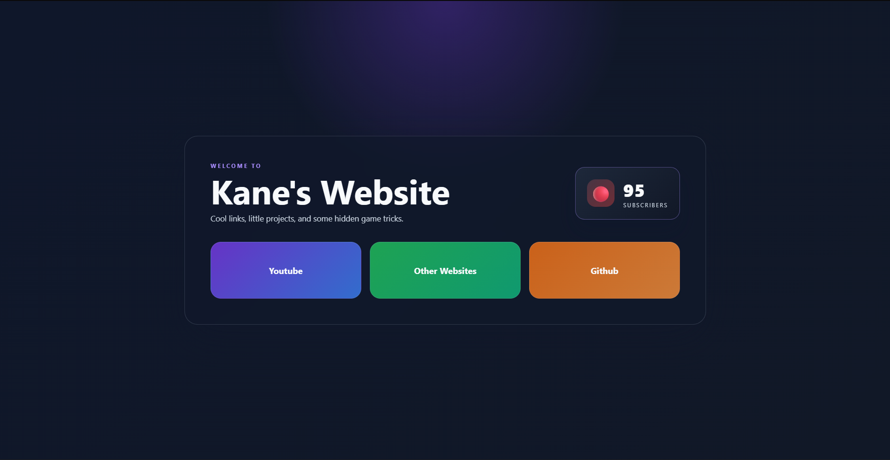
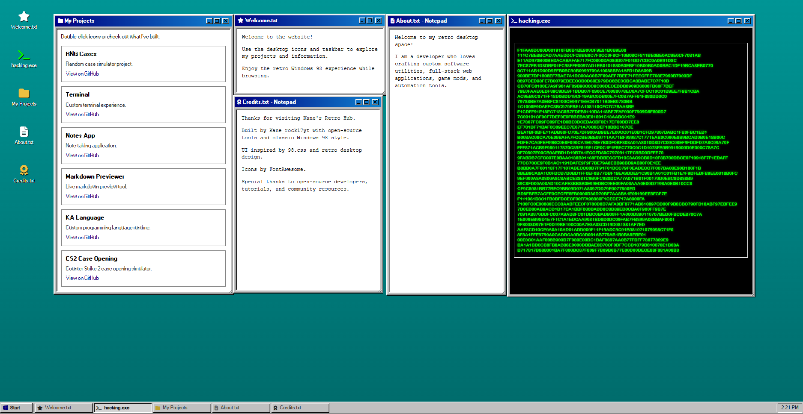

# Kane's Retro Hub

A Windows 98-inspired homepage that links to GitHub projects and uses modular CSS and JavaScript.

## Project structure

- `index.html` - main app shell
- `style.css` - root stylesheet importing modular CSS files
- `css/` - stylesheet modules
- `js/` - application logic modules
- `docs/` - documentation and notes
- `tests/` - test scaffolding

## Included projects

- RNG Cases
- Terminal
- Notes App
- Markdown Previewer
- KA Language
- CS2 Case Opening

## Run locally with Node.js

Run a small Node.js static server to serve the site locally:

```bash
npm install
npm start
```

Then open http://localhost:3000 in your browser.

Alternately, use a quick Python server:

```bash
python3 -m http.server 8000
# open http://127.0.0.1:8000
```

Notes
- The project no longer includes the announce helper. The Contact window only displays links.
- If you want me to add a production-ready Node server or a one-click start script, tell me and I'll add it.

## Previews
### Main Site:

### Retro Hub:

